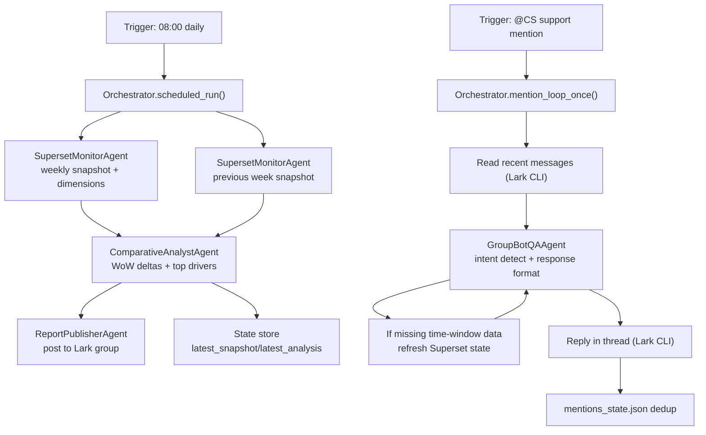

# OpenClaw Agent Graph

## End-to-end graph

## Agent nodes

- `superset_monitor`: fetch metrics/dimensions from Superset.
- `comparative_analyst`: current vs previous weekly comparison.
- `report_publisher`: publish scheduled report to group chat.
- `group_bot_qa`: mention intent routing + structured reply.
- `orchestrator`: controls trigger flow, state, and retries/refresh.

